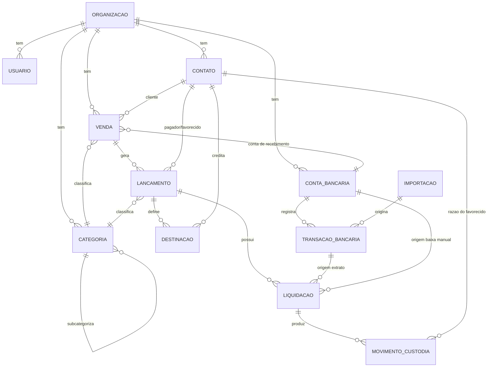

# Arquitetura — Sistema de Gestão de Recebimentos e Repasses

> Documento vivo. Sempre que uma decisão mudar na prática, atualize este arquivo.
> Versionar junto com o código, na raiz do repositório.

---

## 1. Visão geral

**O que é:** um sistema de gestão financeira para quem administra dinheiro de terceiros — recebe valores em nome de clientes, mantém a posição de cada um e repassa o que é devido.

**Parágrafo-síntese:** o sistema ajuda empresas de BPO financeiro e afins a controlar recebimentos e repasses de terceiros num único lugar; diferente do modelo de uma planilha por cliente, ele mantém uma conta corrente por favorecido cujo saldo é consequência dos movimentos conciliados, eliminando a soma manual e o erro silencioso.

**Primeiro usuário:** BPO financeiro com 8 fazendas em carteira, cada uma com dezenas de vendas de gado parceladas, recebidas via Asaas e repassadas integralmente.

**Mercado adjacente (mesmo problema, outra roupa):** imobiliárias (aluguel → locador), construtoras (despesa de obra → cliente), escritórios de advocacia (custas → cliente), administradoras de condomínio. O vocabulário do domínio é deliberadamente genérico — *favorecido*, *venda*, *destinação* — para atender todos sem gambiarra.

**O que o sistema NÃO é (v1):** não emite cobrança, boleto ou PIX. Não integra com API de banco. Não emite documento fiscal. Não faz DRE nem contabilidade. Não compete com Nibo ou Conta Azul em amplitude — compete com a planilha, e precisa ser bom o bastante para substituí-la.

---

## 2. O conceito central: dois livros

A conta bancária mistura dinheiro de terceiros com dinheiro da empresa. O sistema mantém dois registros paralelos e distintos:

| Livro | O que registra | O que mexe nele |
|---|---|---|
| **Caixa** | Saldo real de cada conta bancária | Toda transação do extrato, sem exceção |
| **Custódia** | Razão de cada favorecido — quanto a empresa deve a ele | Apenas recebimentos e repasses **conciliados** |

Taxas do Asaas, aportes para cobrir taxas e transferências entre contas próprias mexem no **caixa** e **não** na custódia — esse dinheiro é da empresa.

**Equação de conferência:**

```
Σ saldos das contas bancárias − Σ saldos de custódia = dinheiro próprio da empresa
```

Toda `ContaBancaria` cadastrada é da organização (§5.1) — dinheiro que não passa por ela, como um pagamento recebido direto na conta pessoal do dono da fazenda, nunca entra no Caixa: não existe uma linha de conta bancária para excluir da equação, porque essa transação nunca teve extrato dentro do sistema. Ela é liquidada por baixa manual (RN-20) e documentada de outro jeito, fora do Caixa.

Se esse número for negativo ou não bater com a expectativa, há erro de lançamento ou conciliação. Esta é a verificação que a planilha nunca ofereceu e é o principal argumento de venda do sistema.

---

## 3. Requisitos

### 3.1 Funcionais — MVP

1. Cadastro de organizações e usuários, com isolamento total de dados entre organizações.
2. Cadastro de contatos, cada um com um único tipo — cliente, fornecedor, favorecido, funcionário ou sócio.
3. Cadastro de contas bancárias — próprias e de terceiros — e categorias de receita/despesa, com subcategorias.
4. Cadastro de vendas — cliente, categoria, descrição, valor, vencimento, forma de pagamento e conta de recebimento — com geração automática das parcelas.
5. Criação manual de lançamentos de recebimento e de pagamento, avulsos ou vinculados a uma venda.
6. Repasse opcional por venda: quando habilitado, um ou mais favorecidos recebem por percentual ou valor fixo. Quando não habilitado, o valor recebido é integralmente da organização e nenhuma destinação é gerada.
7. Importação de extrato bancário em OFX, com prevenção de duplicidade.
8. Conciliação de transação bancária com um ou mais lançamentos, incluindo ajuste de juros, multa e desconto na própria tela.
9. Baixa manual de uma ou mais parcelas pagas diretamente ao favorecido, sem gerar crédito de repasse.
10. Criação de lançamentos novos a partir da tela de conciliação (taxas, aportes, transferências entre contas próprias).
11. Painel de repasses: saldo disponível por favorecido, repasses realizados, pendentes e cancelados.
12. Relatório de conferência caixa × custódia.

### 3.2 Funcional — deliberadamente adiado

Emissão de cobrança · integração bancária via API · conciliação automática por sugestão inteligente · anexo de comprovantes · portal do favorecido · fluxo de caixa projetado · app mobile · relatórios gerenciais avançados · exportação contábil.

*Revisitar quando:* houver segundo cliente pagante usando o sistema em produção.

### 3.3 Não-funcionais relevantes

- **Isolamento entre organizações** é requisito de segurança crítico — vazamento significa expor dados financeiros de terceiros.
- **Integridade transacional**: nenhuma conciliação pode gravar pela metade.
- **Auditabilidade**: todo movimento de custódia rastreável até a transação bancária que o originou e o usuário que o confirmou.
- **Escala real e honesta**: dezenas de organizações, milhares de lançamentos por ano. Não é um problema de escala — é um problema de correção.

---

## 4. Regras de negócio

Numeradas para referência em código, testes e conversas.

**RN-01 — Origem do crédito.** Saldo de custódia só é creditado quando um lançamento de recebimento é conciliado com uma transação bancária de entrada em conta própria. Lançamento previsto, vencido ou em aberto **não** gera saldo.

**RN-01a — Baixa manual não gera custódia.** Recebimento liquidado por baixa manual quita a parcela e atualiza a posição da venda, mas **não gera movimento de custódia nem afeta o caixa**. O dinheiro foi direto para o dono da fazenda — a organização não recebeu nada e não tem o que repassar.

**RN-02 — Valor do crédito.** O crédito é sempre o valor **efetivamente recebido** (líquido conciliado, incluindo juros e multa), nunca o valor previsto.

**RN-03 — Juros, multa e desconto.** Pertencem ao favorecido no modelo de repasse integral. São informados na tela de conciliação para que o valor do lançamento feche com a transação bancária, e compõem o crédito.

**RN-04 — Destinação é opcional.** Uma venda pode ou não ter repasse. Quando não tem, seus lançamentos de recebimento não têm nenhuma linha de destinação — o valor recebido é integralmente da organização, sem mecanismo separado de retenção. Quando tem, cada lançamento de recebimento carrega uma ou mais linhas de destinação cuja soma deve corresponder a exatamente 100% do valor recebido. Não existe estado intermediário: é zero linhas ou soma igual a 100%.

**RN-05 — Rateio em recebimento parcial.** Quando um recebimento com múltiplas destinações é conciliado por valor inferior ao previsto, o sistema **propõe** a divisão proporcional mas **exige confirmação ou ajuste manual** antes de creditar. O sistema nunca decide a divisão sozinho. A decisão fica registrada com usuário e data.

**RN-06 — Recebimento parcial.** Conciliação por valor menor que o previsto deixa o lançamento com status `PARCIAL` e saldo em aberto, disponível para nova conciliação futura.

**RN-07 — Quitação antecipada.** Uma transação bancária pode ser conciliada com múltiplos lançamentos de recebimento da mesma venda, quitando várias parcelas de uma vez.

**RN-08 — Repasse agrupado.** Uma transação bancária de saída pode ser conciliada com múltiplos lançamentos de pagamento. A soma dos valores conciliados deve ser igual ao valor da transação.

**RN-09 — Saldo disponível.** `saldo_disponível(favorecido) = Σ créditos − Σ débitos conciliados − Σ repasses pendentes`. Repasse gerado e ainda não conciliado **reserva** o valor, impedindo que o mesmo saldo seja repassado duas vezes.

**RN-10 — Limite de repasse.** Não é permitido gerar lançamento de repasse superior ao saldo disponível do favorecido.

**RN-11 — Status do repasse.** `PENDENTE` (gerado, aguardando conciliação) · `REALIZADO` (conciliado com transação de saída) · `CANCELADO` (gerado e cancelado; libera o saldo reservado).

**RN-12 — Imutabilidade do movimento.** Movimento de custódia nunca é editado nem apagado diretamente. Corrigir significa desfazer a conciliação que o originou — o que remove o movimento e devolve o lançamento ao status anterior, com registro de auditoria.

**RN-13 — Custódia é derivada.** Nenhum movimento de custódia é criado manualmente. Todo movimento nasce de uma liquidação — de extrato ou manual.

**RN-14 — Fora da custódia.** Taxas bancárias, aportes da empresa para cobrir taxas e transferências entre contas próprias afetam apenas o caixa. Nunca geram movimento de custódia.

**RN-15 — Transferência interna.** Transferência entre contas da própria organização gera um lançamento com duas pernas — saída na conta de origem, entrada na de destino — conciliadas separadamente contra suas respectivas transações de extrato. Requer apenas valor, conta de origem e conta de destino; a descrição é gerada automaticamente. Quando criada a partir da tela de conciliação, o valor é herdado da transação bancária conciliada e o usuário informa somente a conta contrária.

**RN-16 — Deduplicação de extrato.** Transação bancária é única por (conta bancária + identificador do banco). Reimportar o mesmo arquivo OFX não cria duplicatas.

**RN-17 — Geração de parcelas.** Ao criar uma venda com N parcelas, o sistema gera N lançamentos de recebimento numerados, com vencimentos e valores conforme definido, editáveis individualmente antes da conciliação. A base do parcelamento é sempre o `valor` da venda.

**RN-19 — Retirada.** Existia para o detalhamento em itens do antigo `Contrato`. Removida junto com `ItemContrato` quando o conceito de contrato foi substituído por Venda (§5.1) — Venda não tem itens.

**RN-20 — Baixa manual.** Parcelas pagas diretamente ao dono da fazenda — em espécie ou na conta pessoal dele — são liquidadas por baixa manual, sem transação bancária. O usuário seleciona uma ou mais parcelas, informa data e valor recebido, opcionalmente a conta de terceiro onde caiu, e conclui a baixa. Aplicam-se as regras de recebimento parcial (RN-06) e de juros e multa (RN-03); **não** se aplica rateio (RN-05), porque nenhum crédito é gerado.

**RN-21 — Baixa manual nunca em conta própria.** Não é permitida baixa manual apontando para conta da organização. Dinheiro que entra em conta própria **sempre** liquida por conciliação de extrato — caso contrário, a transação apareceria depois no OFX e geraria crédito em duplicidade.

**RN-22 — Reversão da baixa.** Baixa manual é desfeita pelo mesmo caminho da conciliação (RN-12): remove-se a liquidação e o lançamento volta ao status anterior, com registro de auditoria.

**RN-18 — Estorno ao comprador.** Fora de escopo. Quando ocorre, é feito pelo favorecido em sua própria conta, sem trânsito pelo sistema.

---

## 5. Modelo de domínio



### 5.1 Entidades

**Organizacao** — o tenant. `id`, `nome`, `documento`.

**Usuario** — pertence a uma organização. `id`, `organizacao_id`, `nome`, `email`, `papel`.

**Contato** — pessoa ou empresa. `id`, `organizacao_id`, `nome`, `razao_social`, `documento`, `tipo_pessoa` (FISICA | JURIDICA), `tipo_contato` (CLIENTE | FORNECEDOR | FAVORECIDO | FUNCIONARIO | SOCIO), `telefone`, `email`, `cidade`, `estado`, `dados_bancarios`.

> `tipo_contato` é único por contato, não um acúmulo de papéis — cada contato tem exatamente um propósito no sistema. `razao_social` só se aplica a pessoa jurídica; nesse caso `nome` passa a guardar o nome fantasia, e `documento` é o CNPJ. Para pessoa física, `nome` é o nome da pessoa e `documento` é o CPF.

**ContaBancaria** — `id`, `organizacao_id`, `nome`, `banco`, `agencia`, `conta`, `tipo_conta` (CORRENTE | CAIXINHA), `tipo_titular` (FISICA | JURIDICA), `data_inicio_controle`, `saldo_inicial`, `ativa`.

> Toda `ContaBancaria` cadastrada é da organização — não existe mais a distinção PRÓPRIA/TERCEIRO que uma versão anterior deste documento descrevia aqui. `tipo_titular` (PF ou PJ) é sobre em qual CPF/CNPJ a conta está registrada, não sobre a quem ela pertence — uma conta da organização pode estar no CNPJ da empresa ou no CPF de um sócio, por exemplo.
>
> `data_inicio_controle` e `saldo_inicial` andam juntos: `saldo_inicial` é o saldo no fim do dia anterior a `data_inicio_controle`, o ponto de partida a partir do qual o sistema passa a acompanhar a conta.
>
> **Pendência para a Fase 6:** RN-20 permite informar, na baixa manual, uma "conta de terceiro" onde o pagamento caiu — a conta pessoal do dono da fazenda, por exemplo. Isso não é mais uma `ContaBancaria` (que agora é sempre da organização); será modelado quando a Liquidação for implementada, provavelmente como um campo de documentação mais leve em `Liquidacao`, não como um cadastro completo de conta.

**Categoria** — `id`, `organizacao_id`, `categoria_pai_id?`, `nome`, `tipo` (RECEITA | DESPESA).

> Uma subcategoria é uma Categoria com `categoria_pai_id` preenchido, e sempre herda o `tipo` da categoria-pai — não existe subcategoria de receita dentro de uma categoria de despesa. Subcategoria não tem subcategoria própria: a hierarquia tem no máximo dois níveis.

**Venda** — `id`, `organizacao_id`, `numero`, `cliente_id`, `categoria_id`, `descricao`, `valor`, `vencimento`, `forma_pagamento`, `conta_bancaria_id`, `quantidade_parcelas`, `status`.

> Agrupa as parcelas que gera — cada uma é um `Lancamento` com `venda_id`. Sem itens, sem propriedade/fazenda, sem vendedor explícito: quem recebe é definido pelas `Destinacao` das suas parcelas (RN-04), não por um campo da venda. `valor` é sempre a fonte da verdade e é ele que define as parcelas (RN-17).
>
> Substitui o antigo `Contrato`/`ItemContrato`. A mudança existe porque o vocabulário de contrato — partes, propriedade, itens — carregava campos que nenhuma tela usa; venda descreve exatamente o que é cadastrado hoje em `/new-sale`.

**Lancamento** — a previsão de movimento. `id`, `organizacao_id`, `tipo` (RECEBIMENTO | PAGAMENTO | TRANSFERENCIA), `venda_id?`, `contato_id?`, `categoria_id?`, `conta_bancaria_id?`, `numero_parcela?`, `vencimento`, `valor_previsto`, `juros`, `multa`, `desconto`, `valor_liquidado`, `status` (PREVISTO | PARCIAL | LIQUIDADO | CANCELADO), `lancamento_par_id?` (perna oposta de transferência), `descricao?`.

> **Transferência é o caso simples.** Exige apenas valor, conta de origem, conta de destino e uma descrição gerada automaticamente no formato *"Transferência de [conta A] para [conta B]"*. Não tem contato, não tem categoria, não tem venda, não tem destinação — por isso esses campos são opcionais na entidade e a validação exigida varia conforme o `tipo`.
>
> Criada pela tela de conciliação, a transferência **não pede o valor**: ele é o da própria transação bancária que está sendo conciliada. Nesse caso o usuário informa apenas a conta contrária — a outra ponta do movimento.
>
> Recebimento e pagamento seguem a exigência oposta: contato e categoria são obrigatórios. Destinação é opcional em ambos (RN-04) — a venda decide se há repasse, não o lançamento.

**Destinacao** — como o recebimento se divide, quando há repasse. `id`, `lancamento_id`, `favorecido_id`, `modo` (PERCENTUAL | VALOR_FIXO), `valor`, `ordem`. Ausência de linhas para um lançamento significa que o valor recebido é integralmente da organização.

**Importacao** — `id`, `organizacao_id`, `conta_bancaria_id`, `arquivo`, `periodo_inicio`, `periodo_fim`, `importado_em`, `usuario_id`.

**TransacaoBancaria** — a realidade do extrato. `id`, `organizacao_id`, `conta_bancaria_id`, `importacao_id`, `identificador_banco` (FITID), `data`, `valor` (sinal indica entrada/saída), `descricao`, `status` (PENDENTE | CONCILIADA | IGNORADA). **Único por (conta_bancaria_id, identificador_banco).**

**Liquidacao** — o vínculo N:N e a **única** porta de entrada da custódia. `id`, `organizacao_id`, `origem` (EXTRATO | BAIXA_MANUAL), `transacao_id?`, `conta_bancaria_id`, `lancamento_id`, `valor_liquidado`, `data_liquidacao`, `observacao?`, `registrado_em`, `usuario_id`.

> Antes chamada `Conciliacao`. O nome mudou porque agora existem dois caminhos para liquidar um lançamento — conciliação de extrato e baixa manual — mas **um só mecanismo**. Ambos produzem uma linha aqui, e é dela que nasce (ou não) o movimento de custódia. Manter uma porta única é o que impede que a baixa manual vire um atalho que corrompe o razão.
>
> `origem = EXTRATO` exige `transacao_id` e produz movimento de custódia. `origem = BAIXA_MANUAL` exige `data_liquidacao` informada pelo usuário, aceita `conta_bancaria_id` de conta de terceiro apenas como documentação (opcional — pagamento em espécie pode não ter conta), e **nunca** produz movimento de custódia.

**MovimentoCustodia** — o razão. `id`, `organizacao_id`, `favorecido_id`, `liquidacao_id`, `tipo` (CREDITO | DEBITO), `valor`, `data`. Somente-inserção; removido apenas ao desfazer a liquidação de origem.

### 5.2 Invariantes do modelo

- Soma das destinações de um lançamento é zero (sem repasse) ou 100% do valor — nunca um valor intermediário.
- Campos obrigatórios variam por tipo: recebimento e pagamento exigem contato e categoria; transferência exige apenas as duas contas.
- Transferência não tem destinação e nunca gera movimento de custódia.
- Soma dos `valor_conciliado` de uma transação ≤ |valor da transação|.
- Soma dos `valor_conciliado` de um lançamento ≤ valor liquidado do lançamento.
- Saldo de custódia de um favorecido nunca é negativo.
- Todo `MovimentoCustodia` referencia uma `Liquidacao` existente.
- Liquidação com `origem = BAIXA_MANUAL` nunca aponta para conta PRÓPRIA e nunca tem `MovimentoCustodia` associado.

---

## 6. Decisões de arquitetura

### AD-01 — Monólito Next.js (App Router)

**Escolhido:** aplicação única, Next.js servindo interface e servidor.
**Alternativa descartada:** API separada em NestJS.
**Porquê:** o problema é de regra de negócio, não de escala. Uma base, um deploy, tipos compartilhados entre camadas. A alternativa dobraria o custo operacional para um desenvolvedor solo — principal causa de projeto não publicado. A fronteira interna (AD-03) mantém a separação possível no futuro sem reescrita.

### AD-02 — PostgreSQL com Row Level Security

**Escolhido:** Postgres, com RLS ativo em toda tabela que carrega `organizacao_id`.
**Alternativa descartada:** isolamento apenas por filtro na aplicação.
**Porquê:** o custo de um vazamento entre organizações é o negócio inteiro. RLS faz o banco recusar linhas de outro tenant mesmo quando a consulta da aplicação está errada. É o único ponto onde vale pagar complexidade extra no dia 1.

### AD-03 — Camadas: domínio, serviços, bordas

**Escolhido:** três camadas com dependência em sentido único (borda → serviço → domínio).
**Alternativa descartada:** lógica dentro dos componentes de tela.
**Porquê:** as regras de custódia são o ativo do produto. Espalhadas pelas telas, tornam-se impossíveis de testar e de manter coerentes. Detalhado na seção 8.

### AD-04 — Prisma como ORM

**Escolhido:** Prisma, com migrações versionadas.
**Alternativa descartada:** Drizzle, SQL puro.
**Porquê:** tipagem derivada do schema reduz erro de quem está aprendendo backend, e as migrações versionadas são inegociáveis para dados financeiros. Onde uma consulta agregada exigir, cai-se para SQL puro pontualmente — decisão local, não arquitetural.

### AD-05 — Autenticação por biblioteca consolidada

**Escolhido:** biblioteca madura de sessão/autenticação, e-mail e senha na v1, com papéis por organização.
**Descartado:** implementação própria.
**Porquê:** criptografia e gestão de sessão caseiras são risco desnecessário. Sobe-se a escada (social, papéis finos, convite de usuário) só quando houver demanda real.

### AD-06 — Hospedagem gerenciada

**Escolhido:** plataforma gerenciada com Postgres gerenciado ao lado.
**Porquê:** ponto ótimo de custo/benefício para desenvolvedor solo. A escolha exata da plataforma é decisão da Fase 8, sem impacto no código.

### AD-07 — Dinheiro em inteiros

**Escolhido:** todo valor monetário armazenado em centavos (inteiro), nunca em ponto flutuante.
**Porquê:** erro de arredondamento em rateio percentual é o defeito mais insidioso deste tipo de sistema. Também define a regra: **o resíduo do rateio vai para a última destinação**, garantindo que a soma feche exatamente.

---

## 7. Stack

| Camada | Escolha |
|---|---|
| Interface e servidor | Next.js (App Router), TypeScript |
| Estilo e componentes | Tailwind + biblioteca de componentes acessíveis |
| Acesso a dados | Prisma |
| Banco | PostgreSQL com RLS |
| Validação | Zod, compartilhado entre borda e domínio |
| Testes | Vitest (domínio e serviços) |
| Leitura de OFX | Parser de OFX em Node |
| Hospedagem | Plataforma gerenciada + Postgres gerenciado |

---

## 8. Padrões de código e organização

### 8.1 Estrutura

```
src/
  app/                    ← rotas, telas, server actions (BORDA)
  modules/
    vendas/
      dominio/            ← regras puras, sem I/O
      servicos/           ← orquestração + transação de banco
      repositorio.ts      ← acesso a dados
    lancamentos/
    liquidacao/
    custodia/
  shared/                 ← tipos, dinheiro, datas, erros
  db/                     ← schema Prisma, migrações, políticas RLS
```

Organização **por feature**, não por tipo técnico. Cada módulo é autocontido.

### 8.2 As três camadas

**Domínio** — funções puras. Calcular rateio, validar soma das destinações, decidir status do lançamento a partir dos valores conciliados. Sem banco, sem HTTP, sem `async` desnecessário. Testável em milissegundos.

**Serviços** — orquestram um caso de uso completo. Abrem transação de banco, carregam dados, chamam o domínio, gravam, confirmam. São o único lugar que escreve no banco.

**Bordas** — rotas e telas. Validam formato de entrada com Zod, chamam serviço, tratam erro, renderizam. **Nenhuma regra de negócio aqui.**

### 8.3 Regras inegociáveis

1. **Nenhum `MovimentoCustodia` é criado fora de um serviço da camada de custódia.**
2. **Todo serviço que altera custódia executa dentro de uma transação de banco.** Conciliação que grava pela metade corrompe o razão — e razão corrompido com dinheiro de terceiros é o pior defeito possível deste sistema.
3. Toda consulta recebe o contexto de organização; RLS é rede de proteção, não substituto do filtro explícito.
4. Segredos exclusivamente em variáveis de ambiente. Nunca no código, nunca no Git.
5. Nunca desenvolver apontando para o banco de produção.
6. Toda entrada externa validada na fronteira.
7. Commits pequenos e frequentes; refatoração e feature em commits separados.

### 8.4 Testes

Cada regra de negócio da seção 4 ganha teste automatizado antes de ser considerada pronta, cobrindo caminho feliz e casos de borda: valor zero, recebimento parcial, rateio com resíduo de centavos, transação sem lançamento correspondente, dupla conciliação, saldo insuficiente. Cálculo financeiro se testa muito; alinhamento de botão se testa com os olhos.

---

## 9. Riscos e questões em aberto

| Risco | Mitigação |
|---|---|
| Vazamento entre organizações | RLS + teste automatizado que tenta cruzar tenants e deve falhar |
| Conciliação parcialmente gravada | Transação de banco obrigatória + teste de rollback |
| Resíduo de centavos em rateio | Aritmética inteira + regra do resíduo na última destinação |
| Reimportação duplicando extrato | Restrição única (conta, FITID) no banco, não só no código |
| Escopo crescendo até nunca publicar | Sequência de fases com "pronto" objetivo; nada fora do MVP entra antes da Fase 9 |

**Em aberto:** variações de formato OFX entre bancos (validar com arquivo real do Asaas na Fase 5) · política de retenção e backup (definir na Fase 9) · fluxo de convite de usuário para segunda organização (adiado).

---

## 10. Sequência de build

Cada fase entrega uma fatia vertical funcionando e verificável. Não abrir fase nova com a anterior pela metade.

### Fase 1 — Esqueleto que anda
**Objetivo:** aplicação no ar localmente, com login funcionando, isolamento multi-tenant provado e o primeiro cadastro operando de ponta a ponta.
**Tarefas:** projeto Next + TypeScript · Postgres local via Docker · Prisma com `Organizacao`, `Usuario`, `Contato` · autenticação e sessão · políticas RLS · CRUD de contatos com as três camadas · teste de isolamento entre tenants.
**Pronto quando:** dois usuários de organizações diferentes fazem login e cada um vê apenas os próprios contatos — comprovado por teste automatizado que falha se o RLS for desativado.

### Fase 2 — Cadastros de base
**Objetivo:** todos os cadastros que os lançamentos precisam.
**Tarefas:** contas bancárias · categorias · papéis e dados bancários no contato.
**Pronto quando:** é possível cadastrar uma conta bancária, três categorias e um contato completo — documento, telefone, e-mail, cidade, estado, dados bancários — do tipo Favorecido.

### Fase 3 — Vendas e parcelas
**Objetivo:** registrar uma venda e ver suas parcelas geradas.
**Tarefas:** entidade `Venda` (cliente, categoria, descrição, valor, vencimento, forma de pagamento, conta de recebimento) · geração de parcelas a partir do `valor` (RN-17) · repasse opcional por percentual ou valor fixo (RN-04) · listagem de vendas com posição de recebimento.
**Pronto quando:** cadastrar uma venda de 12 parcelas gera 12 lançamentos corretos que somam exatamente o valor total, e a tela da venda exibe quanto já foi recebido e quanto falta.

### Fase 4 — Lançamentos e destinações
**Objetivo:** lançamento manual completo, com a divisão entre favorecidos definida.
**Tarefas:** CRUD de lançamentos de recebimento e pagamento · destinações por percentual e valor fixo (RN-04) · validação da soma em 100% · aritmética de centavos com regra do resíduo (AD-07) · testes das RN-04 e RN-05.
**Pronto quando:** um recebimento de R$ 10.000 dividido em 60%/40% grava destinações que somam exatamente o total, sem centavo perdido.

### Fase 5 — Importação de extrato
**Objetivo:** extrato real do Asaas dentro do sistema.
**Tarefas:** upload e leitura de OFX · criação de transações bancárias · deduplicação por FITID (RN-16) · tela de transações com filtro por status · teste de reimportação.
**Pronto quando:** importar o mesmo arquivo duas vezes resulta no mesmo número de transações.

### Fase 6 — Liquidação de recebimento
**Objetivo:** o coração do sistema — recebimento vira crédito na custódia, pelos dois caminhos possíveis.
**Tarefas:** tela de conciliação com busca de lançamentos candidatos · ajuste de juros, multa e desconto (RN-03) · recebimento parcial (RN-06) · quitação múltipla (RN-07) · confirmação de rateio em parcial (RN-05) · baixa manual de uma ou mais parcelas com data, valor e conta de terceiro opcional (RN-20, RN-21) · geração dos movimentos de custódia dentro de transação, apenas na conciliação de extrato (RN-01, RN-01a) · desfazer liquidação (RN-12, RN-22) · testes das RN-01 a RN-07 e RN-20 a RN-22.
**Pronto quando:** conciliar um recebimento com juros credita o favorecido pelo valor efetivamente recebido; dar baixa manual de outra parcela da mesma venda quita a parcela e **não** altera em nada o saldo de custódia; e desfazer qualquer uma das duas devolve o lançamento ao status anterior.

### Fase 7 — Repasses
**Objetivo:** fechar o ciclo do dinheiro.
**Tarefas:** geração de repasse com validação de saldo (RN-09, RN-10) · reserva de saldo por repasse pendente · conciliação N:N de pagamento (RN-08) · cancelamento liberando saldo (RN-11) · testes das RN-08 a RN-11.
**Pronto quando:** um pagamento de R$ 6.570 é conciliado contra três lançamentos de repasse somando exatamente esse valor, os débitos aparecem na custódia, e o sistema recusa gerar repasse acima do saldo disponível.

### Fase 8 — Lançamentos avulsos e transferências
**Objetivo:** o extrato fecha inteiro, sem transação órfã.
**Tarefas:** criar lançamento direto na tela de conciliação · taxas e aportes fora da custódia (RN-14) · transferência entre contas próprias com duas pernas (RN-15) · marcar transação como ignorada.
**Pronto quando:** um extrato completo do mês é conciliado até não sobrar nenhuma transação pendente.

### Fase 9 — Painel e conferência
**Objetivo:** a visão que substitui as planilhas.
**Tarefas:** saldo disponível por favorecido · repasses realizados, pendentes e cancelados · extrato de custódia por favorecido · relatório de conferência caixa × custódia (seção 2) · exportação em CSV.
**Pronto quando:** o painel reproduz corretamente a posição de uma fazenda real e a equação de conferência fecha.

### Fase 10 — Deploy e operação
**Objetivo:** sistema no ar, em uso real.
**Tarefas:** provisionar hospedagem e banco · variáveis de ambiente conferidas uma a uma · migrações em produção · domínio e HTTPS · roteiro de rollback escrito **antes** do deploy · backup agendado **com ensaio de restauração** · monitor de uptime e captura de erros · checklist manual dos fluxos vitais em produção.
**Pronto quando:** um mês inteiro de operação real é feito no sistema, sem planilha paralela.

---

## 11. Próximo passo

A interface das Fases 3, 6 e 7 já existe (`/new-sale`, `/reconciliation`, `/payout`), construída a partir do Figma e hoje lendo dados mocados — sem banco, sem autenticação, sem persistência. Fase 1, primeira tarefa: **subir o Postgres local via Docker e modelar o schema Prisma com RLS**, antes de ligar qualquer tela ao banco.
