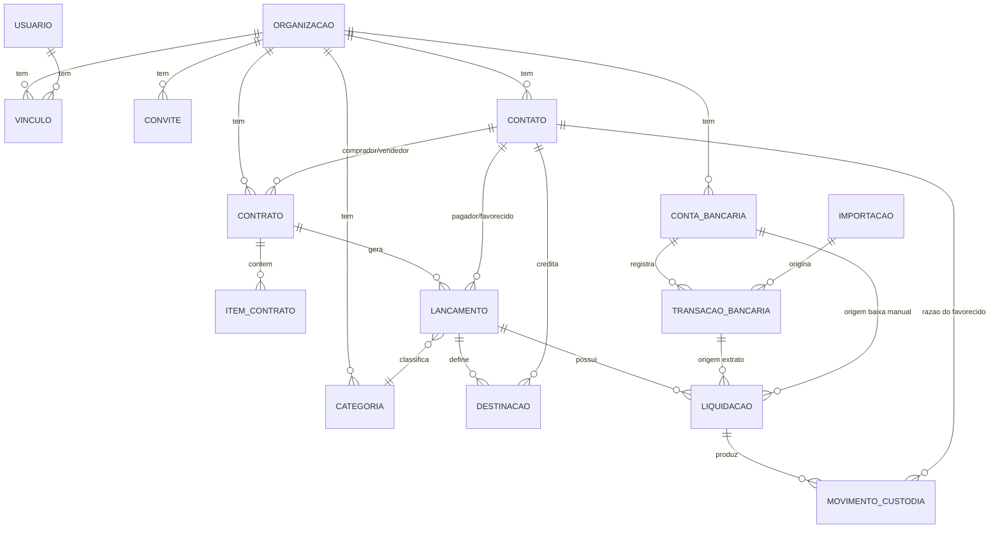

Arquitetura — Sistema de Gestão de Recebimentos e Repasses
> Documento vivo. Sempre que uma decisão mudar na prática, atualize este arquivo.
> Versionar junto com o código, na raiz do repositório.
---
1. Visão geral
O que é: um sistema de gestão financeira para quem administra dinheiro de terceiros — recebe valores em nome de clientes, mantém a posição de cada um e repassa o que é devido.
Parágrafo-síntese: o sistema ajuda empresas de BPO financeiro e afins a controlar recebimentos e repasses de terceiros num único lugar; diferente do modelo de uma planilha por cliente, ele mantém uma conta corrente por favorecido cujo saldo é consequência dos movimentos conciliados, eliminando a soma manual e o erro silencioso.
Primeiro usuário: BPO financeiro com 8 fazendas em carteira, cada uma com dezenas de contratos de venda de gado parcelada, recebidos via Asaas e repassados integralmente.
Mercado adjacente (mesmo problema, outra roupa): imobiliárias (aluguel → locador), construtoras (despesa de obra → cliente), escritórios de advocacia (custas → cliente), administradoras de condomínio. O vocabulário do domínio é deliberadamente genérico — favorecido, contrato, destinação — para atender todos sem gambiarra.
O que o sistema NÃO é (v1): não emite cobrança, boleto ou PIX. Não integra com API de banco. Não emite documento fiscal. Não faz DRE nem contabilidade. Não compete com Nibo ou Conta Azul em amplitude — compete com a planilha, e precisa ser bom o bastante para substituí-la.
---
2. O conceito central: dois livros
A conta bancária mistura dinheiro de terceiros com dinheiro da empresa. O sistema mantém dois registros paralelos e distintos:
Livro	O que registra	O que mexe nele
Caixa	Saldo real de cada conta bancária	Toda transação do extrato, sem exceção
Custódia	Razão de cada favorecido — quanto a empresa deve a ele	Apenas recebimentos e repasses conciliados
Taxas do Asaas, aportes para cobrir taxas e transferências entre contas próprias mexem no caixa e não na custódia — esse dinheiro é da empresa.
Equação de conferência:
```
Σ saldos das contas PRÓPRIAS − Σ saldos de custódia = dinheiro próprio da empresa
```
Toda conta bancária cadastrada pertence à organização e entra na equação.
Se esse número for negativo ou não bater com a expectativa, há erro de lançamento ou conciliação. Esta é a verificação que a planilha nunca ofereceu e é o principal argumento de venda do sistema.
---
3. Requisitos
3.1 Funcionais — MVP
Cadastro aberto de usuários e de organizações, com isolamento total de dados entre organizações. Um mesmo usuário pode pertencer a várias organizações — criando-as ou sendo convidado — com um papel em cada uma.
Cadastro de contatos com múltiplos papéis (pagador, favorecido, fornecedor).
Cadastro de contas bancárias da organização e categorias de receita/despesa.
Cadastro de contratos com itens, partes, valor total e geração automática das parcelas.
Criação manual de lançamentos de recebimento e de pagamento, avulsos ou vinculados a contrato.
Definição de destinação por lançamento de recebimento: um ou mais favorecidos, por percentual ou valor fixo, incluindo a própria organização como destinatária.
Importação de extrato bancário em OFX, com prevenção de duplicidade.
Conciliação de transação bancária com um ou mais lançamentos, incluindo ajuste de juros, multa e desconto na própria tela.
Baixa manual de uma ou mais parcelas pagas diretamente ao favorecido, sem gerar crédito de repasse.
Criação de lançamentos novos a partir da tela de conciliação (taxas, aportes, transferências entre contas próprias).
Painel de repasses: saldo disponível por favorecido, repasses realizados, pendentes e cancelados.
Relatório de conferência caixa × custódia.
Anexar e visualizar o PDF do contrato assinado.
Despesa reembolsável com responsável, e cobrança do saldo a reembolsar.
Categorias em dois níveis e centros de custo, editáveis pelo usuário.
Contas a pagar e a receber: listagem por período, status e faixa de vencimento.
Extrato de conta bancária com saldo corrente.
Relatórios: DRE gerencial, fluxo de caixa projetado, extrato de razão por contato, contas a pagar e a receber com filtro por natureza (despesa própria, repasse, reembolso).
Trilha de auditoria, visível apenas para administradores.
3.2 Funcional — deliberadamente adiado
Emissão de cobrança · integração bancária via API · conciliação automática por sugestão inteligente · anexo de comprovantes de repasse e notas fiscais (a peça genérica nasce na Fase 3.5) · fechamento de período · portal do favorecido · fluxo de caixa projetado · app mobile · relatórios gerenciais avançados · exportação contábil.
Revisitar quando: houver segundo cliente pagante usando o sistema em produção.
3.3 Não-funcionais relevantes
Isolamento entre organizações é requisito de segurança crítico — vazamento significa expor dados financeiros de terceiros.
Integridade transacional: nenhuma conciliação pode gravar pela metade.
Auditabilidade: todo movimento de custódia rastreável até a transação bancária que o originou e o usuário que o confirmou.
Escala real e honesta: dezenas de organizações, milhares de lançamentos por ano. Não é um problema de escala — é um problema de correção.
---
4. Regras de negócio
Numeradas para referência em código, testes e conversas.
RN-01 — Origem do crédito. Saldo de custódia só é creditado quando um lançamento de recebimento é conciliado com uma transação bancária de entrada em conta própria. Lançamento previsto, vencido ou em aberto não gera saldo.
RN-01a — Baixa manual não gera saldo. Recebimento liquidado por baixa manual quita a parcela e atualiza a posição do contrato, mas não gera movimento de custódia nem afeta o saldo de nenhuma conta. O dinheiro não passou pela organização — foi pago no ato da compra ou direto ao favorecido.
RN-02 — Valor do crédito. O crédito é sempre o valor efetivamente recebido (líquido conciliado, incluindo juros e multa), nunca o valor previsto.
RN-03 — Juros, multa e desconto. Pertencem ao favorecido no modelo de repasse integral. São informados na tela de conciliação para que o valor do lançamento feche com a transação bancária, e compõem o crédito.
RN-04 — Destinação. Todo lançamento de recebimento com repasse habilitado — de contrato ou avulso — tem uma ou mais linhas de destinação. A soma das linhas deve corresponder a 100% do valor recebido. A parcela retida pela empresa é uma linha de destinação apontando para a própria organização — não existe mecanismo separado para retenção.
RN-05 — Rateio em recebimento parcial. Quando um recebimento com múltiplas destinações é conciliado por valor inferior ao previsto, o sistema propõe a divisão proporcional mas exige confirmação ou ajuste manual antes de creditar. O sistema nunca decide a divisão sozinho. A decisão fica registrada com usuário e data.
RN-06 — Recebimento parcial. Conciliação por valor menor que o previsto deixa o lançamento com status `PARCIAL` e saldo em aberto, disponível para nova conciliação futura.
RN-07 — Quitação antecipada. Uma transação bancária pode ser conciliada com múltiplos lançamentos de recebimento do mesmo contrato, quitando várias parcelas de uma vez.
RN-08 — Repasse agrupado. Uma transação bancária de saída pode ser conciliada com múltiplos lançamentos de pagamento. A soma dos valores conciliados deve ser igual ao valor da transação.
RN-09 — Saldo disponível. `saldo_disponível(favorecido) = Σ créditos − Σ débitos conciliados − Σ repasses pendentes`. Repasse gerado e ainda não conciliado reserva o valor, impedindo que o mesmo saldo seja repassado duas vezes.
RN-10 — Limite de repasse. Não é permitido gerar lançamento de repasse superior ao saldo disponível do favorecido.
RN-11 — Status do repasse. `PENDENTE` (gerado, aguardando conciliação) · `REALIZADO` (conciliado com transação de saída) · `CANCELADO` (gerado e cancelado; libera o saldo reservado).
RN-12 — Imutabilidade do movimento. Movimento de custódia nunca é editado nem apagado diretamente. Corrigir significa desfazer a conciliação que o originou — o que remove o movimento e devolve o lançamento ao status anterior, com registro de auditoria.
RN-13 — Custódia é derivada. Nenhum movimento de custódia é criado manualmente. Todo movimento nasce de uma liquidação — de extrato ou manual.
RN-14 — Fora da custódia. Taxas bancárias, aportes da empresa para cobrir taxas e transferências entre contas próprias afetam apenas o caixa. Nunca geram movimento de custódia.
RN-15 — Transferência interna. Transferência entre contas da própria organização gera um lançamento com duas pernas — saída na conta de origem, entrada na de destino — conciliadas separadamente contra suas respectivas transações de extrato. Requer apenas valor, conta de origem e conta de destino; a descrição é gerada automaticamente. Quando criada a partir da tela de conciliação, o valor é herdado da transação bancária conciliada e o usuário informa somente a conta contrária.
RN-16 — Deduplicação de extrato. Transação bancária é única por (conta bancária + identificador do banco). Reimportar o mesmo arquivo OFX não cria duplicatas.
RN-17 — Geração de parcelas. Ao criar um contrato com N parcelas, o sistema gera N lançamentos de recebimento numerados, com vencimentos e valores conforme definido, editáveis individualmente antes da conciliação. A base do parcelamento é sempre o `valor_total` do contrato.
RN-19 — Itens são opcionais. Um contrato pode existir sem itens. Quando houver, a divergência entre a soma dos itens e o `valor_total` gera aviso, nunca bloqueio.
RN-20 — Baixa manual. Parcelas pagas diretamente ao dono da fazenda — em espécie ou na conta pessoal dele — são liquidadas por baixa manual, sem transação bancária. O usuário informa valor, data e, opcionalmente, um identificador descrevendo o pagamento (ex.: "pago no ato da compra", "pago diretamente ao favorecido"). A baixa não indica conta bancária. Aplicam-se as regras de recebimento parcial (RN-06) e de juros e multa (RN-03); não se aplica rateio (RN-05), porque nenhum crédito é gerado.
RN-21 — Saldo de conta só nasce da conciliação. Nenhuma conta bancária ganha ou perde saldo por baixa manual. Dinheiro que entra ou sai de uma conta da organização sempre liquida por conciliação de extrato — caso contrário, a transação apareceria depois no OFX e geraria lançamento em duplicidade.
RN-26 — Despesa reembolsável. Um lançamento de pagamento pode ser marcado como reembolsável, indicando o responsável. Quando conciliado com a transação bancária de saída, gera movimento de razão de natureza REEMBOLSO a crédito da organização — ou seja, o responsável passa a dever aquele valor. Aplicam-se as mesmas regras de imutabilidade (RN-12) e origem por liquidação (RN-13) da custódia.
RN-27 — Cobrança de reembolso. O saldo a reembolsar de um responsável pode gerar uma cobrança. Na v1 a cobrança é um documento simples — o que foi gasto, valor, dados para pagamento e identificador — sem emissão de boleto ou PIX. Ela não movimenta o razão; a baixa ocorre quando o reembolso é recebido e conciliado.
RN-28 — Repasse em recebimento avulso. Recebimento avulso também aceita destinação e repasse. O mecanismo é o mesmo do contrato — destinação sobre o lançamento — e existe para não obrigar a criação de contrato fictício quando entra dinheiro de terceiro fora de contrato.
RN-29 — Identificação do contrato. Gerada automaticamente no formato `AAAA-NNNN`, única por organização, editável pelo usuário. A sequência é gerada dentro da transação de criação.
RN-31 — Formas de pagamento. Lista fixa no sistema, cobrindo os meios usados no Brasil: PIX, boleto, transferência, dinheiro, cartão de crédito, cartão de débito, cheque, débito automático e outro. Não é cadastro editável — o conjunto é estável e uma lista fixa evita divergência de nomenclatura entre organizações, o que quebraria relatórios comparativos no futuro.
RN-32 — Papéis de usuário.
Ação	Administrador	Operador	Visualizador
Ver todas as telas e exportar relatórios	✓	✓	✓
Criar e editar lançamentos, contratos, contatos, contas e categorias	✓	✓	—
Inativar e reativar contatos, contas e categorias	✓	✓	—
Conciliar, desfazer conciliação, gerar e cancelar repasse	✓	✓	—
Excluir contatos, contas e categorias	✓	—	—
Convidar, remover e alterar papel de usuários	✓	—	—
Editar dados da organização e excluir a organização	✓	—	—
Consultar a trilha de auditoria	✓	—	—
Inativar é reversível; excluir não. Por isso o operador inativa mas não exclui. O operador desfaz as próprias operações (conciliação, repasse) porque corrigir erros de operação faz parte da função.
RN-33 — Sempre um administrador. A organização tem pelo menos um administrador. O último administrador não pode ser removido nem ter o papel alterado. Quem cria a organização é o primeiro administrador.
RN-34 — Convite. O administrador convida por e-mail e papel; o sistema gera um link (ainda sem envio de e-mail — o administrador copia e envia). O link vale 7 dias, é de uso único e só pode ser aceito pela conta com o e-mail convidado; quem ainda não tem conta cria uma pelo próprio link. Só o hash do token fica no banco, então o link não pode ser exibido de novo: "novo link" gera outro e invalida o anterior, e convidar o mesmo e-mail de novo cancela o convite pendente.
RN-35 — Documento da organização. CNPJ ou CPF, obrigatório, validado pelos dígitos verificadores e único no sistema. Armazenado só com dígitos.
RN-30 — Exclusão de transação bancária. Transação não conciliada pode ser excluída — caso típico de extrato importado por engano. A exclusão é lógica: a linha sai das telas mas o registro permanece com marca de exclusão, usuário e data, preservando a chave do banco para a deduplicação (RN-16). Transação conciliada não pode ser excluída; é preciso desfazer a liquidação antes.
RN-23 — Modalidade de cobrança. Todo contrato declara sua modalidade: parcela única, parcelado ou recorrente. Parcelado divide um valor total entre N parcelas; recorrente repete um valor a cada período, com término por data, por número de ocorrências ou indefinido. O mesmo campo de valor tem significados distintos em cada modalidade e a interface deve deixá-lo explícito.
RN-24 — Conta de recebimento. A conta indicada no lançamento ou contrato é onde se espera que o dinheiro entre, e orienta a busca na conciliação. Se o pagamento não passar pela organização, a parcela é liquidada por baixa manual (RN-20), sem conta.
RN-25 — Rateio vale para o contrato inteiro. A divisão definida no contrato replica-se em todas as parcelas. Não há rateio por parcela.
RN-22 — Reversão da baixa. Baixa manual é desfeita pelo mesmo caminho da conciliação (RN-12): remove-se a liquidação e o lançamento volta ao status anterior, com registro de auditoria.
RN-18 — Estorno ao comprador. Fora de escopo. Quando ocorre, é feito pelo favorecido em sua própria conta, sem trânsito pelo sistema.
---
4b. Vocabulário do produto
Termos que aparecem em tela, código, relatório e conversa com o cliente. Um conceito, um nome.
Termo	Significado
Recebido de / Pago a	A contraparte de um lançamento avulso. Deliberadamente não é "cliente": um recebimento pode vir de venda, de receita financeira ou de estorno de tarifa.
Confere / Não confere / Sem lançamento	Os três estados de uma transação na conciliação.
Liquidação	O ato de quitar um lançamento, por conciliação de extrato ou baixa manual.
Custódia	Dinheiro de terceiro que a organização deve.
Reembolso	Dinheiro da organização que um terceiro deve.
Repasse	Pagamento que quita saldo de custódia.
Destinação	A divisão de um lançamento entre favorecidos.
Categoria / Subcategoria	Os dois níveis de classificação.
4c. Tela inicial
Ordem de prioridade, de cima para baixo:
Contas bancárias — saldo total em destaque e o saldo de cada conta. É a âncora concreta da tela.
Fluxo de caixa do mês corrente — do dia 1 ao último dia do mês, sempre. Saldo inicial, entradas e saídas previstas, resultado projetado. Do dia 1 até hoje é realizado; de hoje até o fim do mês é previsão — a distinção precisa ser visível (marca do dia atual e tonalidade diferente na parte futura), senão previsão é lida como dinheiro em caixa.
Contas a receber e a pagar — corte por urgência: vencido, vence hoje, a vencer.
Trabalho pendente — conciliação aguardando, repasses disponíveis, reembolsos a cobrar. Três cartões pequenos.
Recebimentos por mês — gráfico de barras, até 12 meses. Contexto, não ação: menor prioridade.
Repasses e despesas reembolsáveis entram nos totais do fluxo sem distinção. A tela inicial responde quanto entra e quanto sai da conta — e o dinheiro sai independentemente de quem seja o dono. A distinção por natureza existe no relatório de contas a pagar e receber, que filtra por despesa própria, repasse e reembolso.
Não há gráfico de resultado por categoria na tela inicial.
5. Modelo de domínio

```mermaid
erDiagram
    ORGANIZACAO ||--o{ VINCULO : tem
    USUARIO ||--o{ VINCULO : tem
    ORGANIZACAO ||--o{ CONVITE : tem
    ORGANIZACAO ||--o{ CONTATO : tem
    ORGANIZACAO ||--o{ CONTA_BANCARIA : tem
    ORGANIZACAO ||--o{ CATEGORIA : tem
    ORGANIZACAO ||--o{ CONTRATO : tem

    CONTRATO ||--o{ ITEM_CONTRATO : contem
    CONTRATO ||--o{ LANCAMENTO : gera
    CONTATO ||--o{ CONTRATO : "comprador/vendedor"

    LANCAMENTO ||--o{ DESTINACAO : define
    LANCAMENTO ||--o{ LIQUIDACAO : possui
    LANCAMENTO }o--|| CATEGORIA : classifica
    LANCAMENTO }o--|| CONTATO : "pagador/favorecido"

    DESTINACAO }o--|| CONTATO : credita

    CONTA_BANCARIA ||--o{ TRANSACAO_BANCARIA : registra
    IMPORTACAO ||--o{ TRANSACAO_BANCARIA : origina
    TRANSACAO_BANCARIA ||--o{ LIQUIDACAO : "origem extrato"
    CONTA_BANCARIA ||--o{ LIQUIDACAO : "origem baixa manual"

    LIQUIDACAO ||--o{ MOVIMENTO_CUSTODIA : produz
    CONTATO ||--o{ MOVIMENTO_CUSTODIA : "razao do favorecido"
```
5.1 Entidades
Organizacao — o tenant. `id`, `nome`, `documento` (único, RN-35).
Usuario — a pessoa, global ao sistema. `id`, `nome`, `email` (único), `senha_hash`, `ativo`. Não pertence a uma organização: o acesso vem dos vínculos.
Vinculo (`memberships`) — `id`, `organizacao_id`, `usuario_id`, `papel` (ADMINISTRADOR | OPERADOR | VISUALIZADOR). Único por (usuario, organizacao).
Convite (`invitations`) — `id`, `organizacao_id`, `email`, `papel`, `token_hash`, `convidado_por_id`, `expira_em`, `aceito_em?`, `cancelado_em?` (RN-34).
> **Organização na URL, não na sessão.** A sessão identifica só a pessoa. Toda tela de organização vive em `/o/<organizacao_id>/...`, então abas diferentes podem ter empresas diferentes abertas ao mesmo tempo. O `proxy.ts` repassa o id da URL num header para a página ou server action (uma server action é um POST para a página que a chamou, então herda a empresa da aba), e cada requisição confere o vínculo do usuário com essa organização antes de qualquer consulta. Sem vínculo, a resposta é 404 — igual a uma organização inexistente.
> Permissões detalhadas na RN-32. Sempre existe ao menos um administrador (RN-33).
Contato — pessoa ou empresa. `id`, `organizacao_id`, `nome`, `documento`, `tipo_pessoa`, `telefone`, `email`, `cidade`, `estado`, `dados_bancarios`, `chave_pix?`, `tipo_chave_pix?` (CPF | CNPJ | EMAIL | TELEFONE | ALEATORIA), `papeis[]` (PAGADOR, FAVORECIDO, FORNECEDOR — um contato pode acumular).
ContaBancaria — `id`, `organizacao_id`, `nome`, `banco`, `agencia`, `conta`, `saldo_inicial`, `ativa`.
> Toda conta cadastrada pertence à organização. Seu saldo muda apenas por conciliação de extrato (RN-21).
>
> Um único atributo governa as duas dimensões porque, na operação real, dinheiro que não passa pela organização nunca tem extrato disponível, e dinheiro que passa sempre tem. Se um dia existir conta própria sem extrato — caixa físico da empresa — será preciso separar as dimensões de novo. Hoje, não existe.
Categoria — `id`, `organizacao_id`, `nome`, `tipo` (RECEITA | DESPESA), `categoria_pai_id?`, `ativa`.
> Dois níveis: **Categoria** e **Subcategoria**. Totalmente editável pelo usuário — o sistema entrega uma árvore inicial sugerida, não fixa. Categoria sem pai é raiz; com pai é subcategoria. Não há terceiro nível.
CentroCusto — `id`, `organizacao_id`, `nome`, `ativo`. Segundo eixo de classificação, independente da categoria.
Contrato — `id`, `organizacao_id`, `identificacao`, `contato_id`, `categoria_id`, `centro_custo_id?`, `descricao`, `modalidade` (PARCELADO | RECORRENTE), `periodicidade`, `forma_pagamento` (PIX | BOLETO | TRANSFERENCIA | DINHEIRO | CARTAO_CREDITO | CARTAO_DEBITO | CHEQUE | DEBITO_AUTOMATICO | OUTRO), `conta_id`, `valor_total`, `quantidade_parcelas?`, `observacoes`, `status`.
> `identificacao` é **gerada automaticamente** no formato `AAAA-NNNN` (ex.: 2026-0001), aparece já preenchida como primeiro campo da tela e pode ser substituída por texto livre. É **única por organização** — a sequência é por tenant e gerada dentro da transação de criação, senão dois contratos simultâneos colidem.
>
> **Não há campo de vendedor.** Quando o contrato tem repasse habilitado, o favorecido da destinação já é quem vendeu — o campo seria redundante. `contato_id` é a contraparte: quem paga, num contrato de receita; quem recebe, num de despesa.
>
> **Não há modalidade de parcela única** — lançamento sem parcelamento é avulso, criado fora do contrato.
>
> `modalidade` decide o significado de `valor_total`: em PARCELADO ele é o total a dividir; em RECORRENTE é o valor de cada ocorrência e `quantidade_parcelas` pode ser nulo (sem fim definido).
>
> Os dados das partes — nome, documento, telefone, e-mail, cidade e estado — vivem em `Contato` e são exibidos na tela do contrato por referência, nunca copiados. Assim, corrigir um telefone atualiza todos os contratos daquela pessoa de uma vez.
ItemContrato — `id`, `contrato_id`, `descricao`, `quantidade`, `valor_unitario`.
> **Opcional.** Um contrato é válido sem nenhum item. Os itens são detalhamento descritivo — úteis para saber o que foi vendido, irrelevantes para o fluxo financeiro. O `valor_total` do contrato é sempre a fonte da verdade e é ele que define as parcelas.
>
> Se houver itens e a soma deles não bater com o `valor_total`, o sistema **avisa mas não bloqueia** — a divergência pode ser legítima (frete, desconto negociado, arredondamento), e travar o cadastro por isso atrapalharia mais do que ajudaria. O aviso existe só para você não descobrir um erro de digitação três meses depois.
Lancamento — a previsão de movimento. `id`, `organizacao_id`, `tipo` (RECEBIMENTO | PAGAMENTO | TRANSFERENCIA), `contrato_id?`, `contato_id?`, `categoria_id?`, `conta_bancaria_id?`, `numero_parcela?`, `vencimento`, `valor_previsto`, `juros`, `multa`, `desconto`, `valor_liquidado`, `status` (PREVISTO | PARCIAL | LIQUIDADO | CANCELADO), `lancamento_par_id?` (perna oposta de transferência), `descricao?`, `forma_pagamento?`, `centro_custo_id?`, `reembolsavel`, `responsavel_id?`.
> **Transferência é o caso simples.** Exige apenas valor, conta de origem, conta de destino e uma descrição gerada automaticamente no formato *"Transferência de [conta A] para [conta B]"*. Não tem contato, não tem categoria, não tem contrato, não tem destinação — por isso esses campos são opcionais na entidade e a validação exigida varia conforme o `tipo`.
>
> Criada pela tela de conciliação, a transferência **não pede o valor**: ele é o da própria transação bancária que está sendo conciliada. Nesse caso o usuário informa apenas a conta contrária — a outra ponta do movimento.
>
> Recebimento e pagamento seguem a exigência oposta: contato e categoria são obrigatórios, e recebimento exige destinação.
Destinacao — como o lançamento se divide entre terceiros. `id`, `lancamento_id`, `favorecido_id`, `modo` (PERCENTUAL | VALOR_FIXO), `valor`, `ordem`.
Importacao — `id`, `organizacao_id`, `conta_bancaria_id`, `arquivo`, `periodo_inicio`, `periodo_fim`, `importado_em`, `usuario_id`.
TransacaoBancaria — a realidade do extrato. `id`, `organizacao_id`, `conta_bancaria_id`, `importacao_id`, `identificador_banco` (FITID), `data`, `valor` (sinal indica entrada/saída), `descricao`, `status` (PENDENTE | CONCILIADA | IGNORADA). Único por (conta_bancaria_id, identificador_banco).
Liquidacao — o vínculo N:N e a única porta de entrada da custódia. `id`, `organizacao_id`, `origem` (EXTRATO | BAIXA_MANUAL), `transacao_id?`, `conta_bancaria_id`, `lancamento_id`, `valor_liquidado`, `data_liquidacao`, `observacao?`, `registrado_em`, `usuario_id`.
> Antes chamada `Conciliacao`. O nome mudou porque agora existem dois caminhos para liquidar um lançamento — conciliação de extrato e baixa manual — mas **um só mecanismo**. Ambos produzem uma linha aqui, e é dela que nasce (ou não) o movimento de custódia. Manter uma porta única é o que impede que a baixa manual vire um atalho que corrompe o razão.
>
> `origem = EXTRATO` exige `transacao_id` e produz movimento de custódia. `origem = BAIXA_MANUAL` exige `data_liquidacao` informada pelo usuário, não referencia conta bancária, aceita um identificador livre opcional, e **nunca** produz movimento de custódia nem altera saldo.
Anexo — arquivo vinculado a um registro. `id`, `organizacao_id`, `entidade` (CONTRATO | LANCAMENTO | LIQUIDACAO), `entidade_id`, `nome_arquivo`, `caminho`, `tipo_mime`, `tamanho`, `enviado_em`, `usuario_id`.
> Genérico de propósito. O primeiro uso é o PDF do contrato assinado, mas comprovante de repasse e nota fiscal usarão a mesma peça. Arquivos ficam no Supabase Storage; o acesso é liberado por link temporário gerado pelo servidor **após** verificar a organização — o Storage não conhece a sessão do Better Auth, então a checagem é explícita, como no RLS via Prisma.
MovimentoRazao — o razão de terceiros. `id`, `organizacao_id`, `contato_id`, `liquidacao_id`, `natureza` (CUSTODIA | REEMBOLSO), `tipo` (CREDITO | DEBITO), `valor`, `data`. Somente-inserção; removido apenas ao desfazer a liquidação de origem.
> **Uma tabela, duas naturezas.** `CUSTODIA` é dinheiro de terceiro que a organização deve (recebimento conciliado credita; repasse conciliado debita). `REEMBOLSO` é dinheiro da organização que o terceiro deve (despesa reembolsável conciliada credita; reembolso recebido debita).
>
> São espelhos: mesma mecânica, sinal invertido. Manter numa estrutura só evita duas implementações paralelas da regra mais crítica do sistema — que divergiriam com o tempo. O saldo de um contato é sempre `Σ créditos − Σ débitos` dentro de uma natureza.
5.2 Invariantes do modelo
Soma das destinações de um lançamento = 100% do valor.
Campos obrigatórios variam por tipo: recebimento e pagamento exigem contato e categoria; transferência exige apenas as duas contas.
Transferência não tem destinação e nunca gera movimento de custódia.
Soma dos `valor_conciliado` de uma transação ≤ |valor da transação|.
Soma dos `valor_conciliado` de um lançamento ≤ valor liquidado do lançamento.
Saldo de custódia de um favorecido nunca é negativo.
Todo `MovimentoCustodia` referencia uma `Liquidacao` existente.
Liquidação com `origem = BAIXA_MANUAL` nunca aponta para conta PRÓPRIA e nunca tem `MovimentoCustodia` associado.
---
6. Decisões de arquitetura
AD-01 — Monólito Next.js (App Router)
Escolhido: aplicação única, Next.js servindo interface e servidor.
Alternativa descartada: API separada em NestJS.
Porquê: o problema é de regra de negócio, não de escala. Uma base, um deploy, tipos compartilhados entre camadas. A alternativa dobraria o custo operacional para um desenvolvedor solo — principal causa de projeto não publicado. A fronteira interna (AD-03) mantém a separação possível no futuro sem reescrita.
AD-02 — PostgreSQL com Row Level Security
Escolhido: Postgres, com RLS ativo em toda tabela que carrega `organizacao_id`.
Alternativa descartada: isolamento apenas por filtro na aplicação.
Porquê: o custo de um vazamento entre organizações é o negócio inteiro. RLS faz o banco recusar linhas de outro tenant mesmo quando a consulta da aplicação está errada. É o único ponto onde vale pagar complexidade extra no dia 1.
AD-03 — Camadas: domínio, serviços, bordas
Escolhido: três camadas com dependência em sentido único (borda → serviço → domínio).
Alternativa descartada: lógica dentro dos componentes de tela.
Porquê: as regras de custódia são o ativo do produto. Espalhadas pelas telas, tornam-se impossíveis de testar e de manter coerentes. Detalhado na seção 8.
AD-04 — Prisma como ORM
Escolhido: Prisma, com migrações versionadas.
Alternativa descartada: Drizzle, SQL puro.
Porquê: tipagem derivada do schema reduz erro de quem está aprendendo backend, e as migrações versionadas são inegociáveis para dados financeiros. Onde uma consulta agregada exigir, cai-se para SQL puro pontualmente — decisão local, não arquitetural.
AD-05 — Autenticação por biblioteca consolidada
Escolhido: biblioteca madura de sessão/autenticação, e-mail e senha na v1, com papéis por organização.
Descartado: implementação própria.
Porquê: criptografia e gestão de sessão caseiras são risco desnecessário. Sobe-se a escada (social, papéis finos, convite de usuário) só quando houver demanda real.
> Na prática a v1 ficou com sessão opaca própria no banco (token aleatório, só o hash armazenado, senha com argon2) — pequena o bastante para revisar inteira. Cadastro aberto, convite por link e papéis por organização (VISUALIZADOR só lê, OPERADOR opera, ADMINISTRADOR também gerencia membros) já estão implementados; a checagem de papel acontece na borda (server actions) e os serviços continuam sem saber de papéis. Pendentes: verificação de e-mail, "esqueci a senha" e envio de convite por e-mail — todos dependem de um provedor de e-mail.
AD-06 — Hospedagem gerenciada
Escolhido: plataforma gerenciada com Postgres gerenciado ao lado.
Porquê: ponto ótimo de custo/benefício para desenvolvedor solo. A escolha exata da plataforma é decisão da Fase 8, sem impacto no código.
AD-07 — Dinheiro em inteiros
Escolhido: todo valor monetário armazenado em centavos (inteiro), nunca em ponto flutuante.
Porquê: erro de arredondamento em rateio percentual é o defeito mais insidioso deste tipo de sistema. Também define a regra: o resíduo do rateio vai para a última destinação, garantindo que a soma feche exatamente.
---
7. Stack
Camada	Escolha
Armazenamento de arquivos	Supabase Storage
Interface e servidor	Next.js (App Router), TypeScript
Estilo e componentes	Tailwind + biblioteca de componentes acessíveis
Acesso a dados	Prisma
Banco	PostgreSQL com RLS
Validação	Zod, compartilhado entre borda e domínio
Testes	Vitest (domínio e serviços)
Leitura de OFX	Parser de OFX em Node
Hospedagem	Plataforma gerenciada + Postgres gerenciado
---
8. Padrões de código e organização
8.1 Estrutura
```
src/
  app/                    ← rotas, telas, server actions (BORDA)
  modules/
    contratos/
      dominio/            ← regras puras, sem I/O
      servicos/           ← orquestração + transação de banco
      repositorio.ts      ← acesso a dados
    lancamentos/
    liquidacao/
    custodia/
  shared/                 ← tipos, dinheiro, datas, erros
  db/                     ← schema Prisma, migrações, políticas RLS
```
Organização por feature, não por tipo técnico. Cada módulo é autocontido.
8.2 As três camadas
Domínio — funções puras. Calcular rateio, validar soma das destinações, decidir status do lançamento a partir dos valores conciliados. Sem banco, sem HTTP, sem `async` desnecessário. Testável em milissegundos.
Serviços — orquestram um caso de uso completo. Abrem transação de banco, carregam dados, chamam o domínio, gravam, confirmam. São o único lugar que escreve no banco.
Bordas — rotas e telas. Validam formato de entrada com Zod, chamam serviço, tratam erro, renderizam. Nenhuma regra de negócio aqui.
8.3 Regras inegociáveis
Nenhum `MovimentoCustodia` é criado fora de um serviço da camada de custódia.
Todo serviço que altera custódia executa dentro de uma transação de banco. Conciliação que grava pela metade corrompe o razão — e razão corrompido com dinheiro de terceiros é o pior defeito possível deste sistema.
Toda consulta recebe o contexto de organização; RLS é rede de proteção, não substituto do filtro explícito.
Segredos exclusivamente em variáveis de ambiente. Nunca no código, nunca no Git.
Nunca desenvolver apontando para o banco de produção.
Toda entrada externa validada na fronteira.
Commits pequenos e frequentes; refatoração e feature em commits separados.
8.4 Testes
Cada regra de negócio da seção 4 ganha teste automatizado antes de ser considerada pronta, cobrindo caminho feliz e casos de borda: valor zero, recebimento parcial, rateio com resíduo de centavos, transação sem lançamento correspondente, dupla conciliação, saldo insuficiente. Cálculo financeiro se testa muito; alinhamento de botão se testa com os olhos.
---
9. Riscos e questões em aberto
Risco	Mitigação
Vazamento entre organizações	RLS + teste automatizado que tenta cruzar tenants e deve falhar
Conciliação parcialmente gravada	Transação de banco obrigatória + teste de rollback
Resíduo de centavos em rateio	Aritmética inteira + regra do resíduo na última destinação
Reimportação duplicando extrato	Restrição única (conta, FITID) no banco, não só no código
Anexo acessível por outra organização	Link temporário gerado pelo servidor após checagem explícita; teste automatizado de acesso cruzado
Escopo crescendo até nunca publicar	Sequência de fases com "pronto" objetivo; nada fora do MVP entra antes da Fase 9
Em aberto: variações de formato OFX entre bancos (validar com arquivo real do Asaas na Fase 5) · política de retenção e backup (definir na Fase 9) · provedor de e-mail (verificação de conta, recuperação de senha, envio automático de convite).
---
10. Sequência de build
Cada fase entrega uma fatia vertical funcionando e verificável. Não abrir fase nova com a anterior pela metade.
Fase 1 — Esqueleto que anda
Objetivo: aplicação no ar localmente, com login funcionando, isolamento multi-tenant provado e o primeiro cadastro operando de ponta a ponta.
Tarefas: projeto Next + TypeScript · Postgres local via Docker · Prisma com `Organizacao`, `Usuario`, `Contato` · autenticação e sessão · políticas RLS · CRUD de contatos com as três camadas · teste de isolamento entre tenants.
Pronto quando: dois usuários de organizações diferentes fazem login e cada um vê apenas os próprios contatos — comprovado por teste automatizado que falha se o RLS for desativado.
Fase 2 — Cadastros de base
Objetivo: todos os cadastros que os lançamentos precisam.
Tarefas: contas bancárias · categorias em dois níveis, editáveis · centros de custo · papéis, dados bancários e chave PIX no contato · papéis de usuário (administrador, operador e visualizador — RN-32 e RN-33) · componentes de listagem (filtro, ordenação, busca, paginação, exportação CSV) e de formatação brasileira (moeda, data, documento).
Pronto quando: é possível cadastrar uma conta bancária própria, uma árvore de categorias com subcategorias, um centro de custo e um contato completo com chave PIX e papel de favorecido; e um usuário sem papel de administrador é impedido de alterar essas configurações.
Fase 3 — Contratos e parcelas
Objetivo: registrar um contrato de venda e ver suas parcelas geradas.
Tarefas: entidades `Contrato` e `ItemContrato` (itens opcionais) · modalidade única, parcelada e recorrente (RN-23) · forma de pagamento e conta de recebimento (RN-24) · geração de parcelas a partir do `valor_total` (RN-17) · listagem de contratos com posição de recebimento · edição de parcela individual.
Pronto quando: cadastrar um contrato parcelado de 12 vezes gera 12 lançamentos corretos; um contrato recorrente sem fim gera as ocorrências do período; e a tela do contrato mostra as partes e quanto já foi recebido e quanto falta.
Fase 3.5 — Anexos
Objetivo: guardar e visualizar o PDF do contrato assinado dentro do sistema.
Tarefas: bucket no Supabase Storage · entidade `Anexo` genérica · upload com validação de tipo e tamanho · geração de link temporário com verificação de organização · visualizador embutido no navegador · exclusão de anexo · teste de isolamento (organização A não acessa arquivo de B).
Pronto quando: um PDF anexado a um contrato abre dentro do sistema, e o link direto do arquivo é recusado para usuário de outra organização.
Fase 4 — Lançamentos e destinações
Objetivo: lançamento manual completo, com a divisão entre favorecidos definida.
Tarefas: CRUD de lançamentos de recebimento e pagamento · destinações por percentual e valor fixo (RN-04) · validação da soma em 100% · aritmética de centavos com regra do resíduo (AD-07) · testes das RN-04 e RN-05.
Pronto quando: um recebimento de R$ 10.000 dividido em 60%/40% grava destinações que somam exatamente o total, sem centavo perdido.
Fase 5 — Importação de extrato
Objetivo: extrato real do Asaas dentro do sistema.
Tarefas: upload e leitura de OFX · criação de transações bancárias · deduplicação por FITID (RN-16) · tela de transações com filtro por status · teste de reimportação.
Pronto quando: importar o mesmo arquivo duas vezes resulta no mesmo número de transações.
Fase 6 — Liquidação de recebimento
Objetivo: o coração do sistema — recebimento vira crédito na custódia, pelos dois caminhos possíveis.
Tarefas: tela de conciliação com busca de lançamentos candidatos · ajuste de juros, multa e desconto (RN-03) · recebimento parcial (RN-06) · quitação múltipla (RN-07) · confirmação de rateio em parcial (RN-05) · baixa manual com valor, data e identificador opcional, sem conta (RN-20, RN-21) · geração dos movimentos de custódia dentro de transação, apenas na conciliação de extrato (RN-01, RN-01a) · desfazer liquidação (RN-12, RN-22) · testes das RN-01 a RN-07 e RN-20 a RN-22.
Pronto quando: conciliar um recebimento com juros credita o favorecido pelo valor efetivamente recebido; dar baixa manual de outra parcela do mesmo contrato quita a parcela e não altera em nada o saldo de custódia; e desfazer qualquer uma das duas devolve o lançamento ao status anterior.
Fase 7 — Repasses
Objetivo: fechar o ciclo do dinheiro.
Tarefas: geração de repasse com validação de saldo (RN-09, RN-10) · reserva de saldo por repasse pendente · conciliação N:N de pagamento (RN-08) · cancelamento liberando saldo (RN-11) · testes das RN-08 a RN-11.
Pronto quando: um pagamento de R$ 6.570 é conciliado contra três lançamentos de repasse somando exatamente esse valor, os débitos aparecem na custódia, e o sistema recusa gerar repasse acima do saldo disponível.
Fase 7.5 — Despesas reembolsáveis
Objetivo: o espelho da custódia — dinheiro da organização que terceiros devem.
Tarefas: marcar lançamento de pagamento como reembolsável com responsável (RN-26) · geração de movimento de razão natureza REEMBOLSO na conciliação · painel de reembolsos com a reembolsar, cobrado e recebido · documento de cobrança simples, sem boleto ou PIX (RN-27) · baixa por conciliação do reembolso recebido · testes das RN-26 e RN-27.
Pronto quando: conciliar uma despesa marcada como reembolsável cria saldo a receber do responsável, a cobrança gera o documento, e o recebimento do reembolso zera o saldo.
Fase 8 — Lançamentos avulsos e transferências
Objetivo: o extrato fecha inteiro, sem transação órfã.
Tarefas: criar lançamento direto na tela de conciliação · taxas e aportes fora da custódia (RN-14) · transferência entre contas próprias com duas pernas (RN-15) · marcar transação como ignorada.
Pronto quando: um extrato completo do mês é conciliado até não sobrar nenhuma transação pendente.
Fase 8.5 — Auditoria
Objetivo: tornar o histórico defensável e os relatórios estáveis.
Tarefas: trilha de auditoria (quem, o quê, quando) em toda alteração de lançamento, liquidação e configuração · tela de consulta da trilha, restrita a administradores.
Pronto quando: alterar um lançamento gera registro de auditoria consultável, e tentar editar um lançamento em período fechado é recusado.
Fase 9 — Painel e conferência
Objetivo: a visão que substitui as planilhas.
Tarefas: saldo disponível por favorecido · repasses realizados, pendentes e cancelados · extrato de razão por contato (custódia e reembolso) · extrato de conta bancária com saldo corrente · contas a pagar e a receber por período, faixa de vencimento e natureza · DRE gerencial por categoria · fluxo de caixa do mês corrente, distinguindo realizado de previsto · relatório de conferência caixa × custódia (seção 2) · visão geral · exportação em CSV.
Pronto quando: o painel reproduz corretamente a posição de uma fazenda real e a equação de conferência fecha.
Fase 10 — Deploy e operação
Objetivo: sistema no ar, em uso real.
Tarefas: provisionar hospedagem e banco · variáveis de ambiente conferidas uma a uma · migrações em produção · domínio e HTTPS · roteiro de rollback escrito antes do deploy · backup agendado com ensaio de restauração · monitor de uptime e captura de erros · checklist manual dos fluxos vitais em produção.
Pronto quando: um mês inteiro de operação real é feito no sistema, sem planilha paralela.
---
11. Próximo passo
Fase 1, primeira tarefa: inicializar o projeto Next.js com TypeScript e subir o Postgres local, antes de qualquer modelagem no Prisma.
